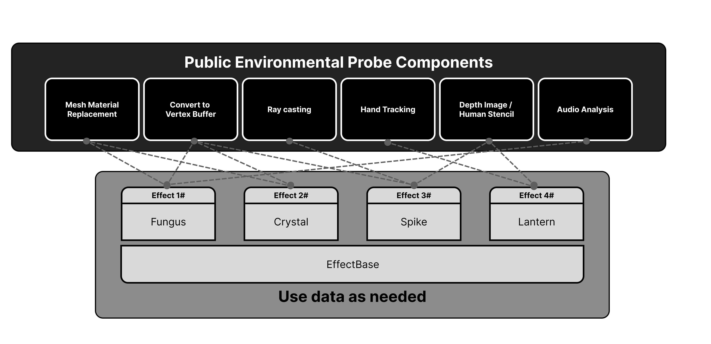
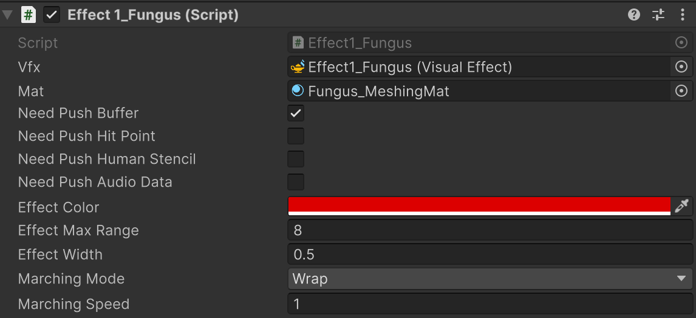

# FungiSync

## Thematic Statement
Recent years, cascade of global disruptions - the U.S.-China trade war, COVID-19 pandemic, Russia's invasion of Ukraine, and climate change pressures - has accelerated deglobalization. These crises exposed critical vulnerabilities in centralized institutions, compelling governments and corporations to reevaluate their external dependencies amid deepening ideological divides. As nations prioritized domestic resilience over global efficiency, the result was fractured supply chains, hardened borders, and heightened geopolitical tensions.

Yet this fragmentation catalyzed the emergence of alternative systems. Decentralized networks gained momentum, offering novel approaches to human organization. Nature provides an illuminating model through the Wood Wide Web - the vast mycorrhizal fungal network that underlies forest ecosystems.

While trees dominate the visible forest landscape, it's the unseen fungal networks beneath that truly bind the ecosystem together. These underground connections facilitate resource sharing and communication, creating resilient communities through distributed cooperation. This natural architecture parallels emerging decentralized technologies, which aim to build digital ecosystems based on peer-to-peer networks rather than centralized control.

The relationship between visible trees and unseen fungal networks offers a powerful metaphor for the complementary role of decentralized systems alongside traditional institutions. Just as forests thrive through the interplay of visible and hidden networks, human society might achieve greater resilience through a hybrid approach - maintaining essential centralized structures while nurturing decentralized alternatives that enhance adaptability and cooperation.

This natural model demonstrates how complex systems can self-organize and sustain themselves through distributed relationships, suggesting a path toward more resilient social and technological architectures.

## Artworks

Fungisync is a mixed reality participatory ritual performance inspired by the mycorrhizal network "Wood Wide Web" to foster human plurality and collective wisdom. Participants wear masquerade-style mushroom-decorated mixed reality masks—metaphors for technology-mediated pluriversal worldviews—becoming living nodes in a dynamically evolving mycorrhizal network of shared consciousness. Through various ritualized secret handshakes, the most ancient protocols, they exchange and blend distinct worldviews, mirroring how fungi orchestrate resource sharing and signal exchange in the "Wood Wide Web." This embodied network performance manifests actor-network theory through interspecies dialogue, celebrating the entanglement of multiple worlds in a decentralized web of infinite collaboration, enhancing mycological awareness of decentralized technology's role in today's deglobalizing world. Let’s Celebrating Mycopunk!

## User Experience Before, During, After Handshakes

The user experience is walk-in and walk-out; it's not round-based. Participants can enter and exit at any time. Anyone can approach the central Garden Tower to pick up a mask, participate, and then return it, allowing for fluid entry and exit from the experience. 

Before: When two users come within 2 meter, a spore particle stream will exchange between user users’s hand or head to lead user to handshake. When two users come within 1 meter of each other, a visual blending effect occurs, gradually intensifying as the distance decreases. (80% self, 20% other) 

During handshakes: The blending effect reaches its maximum. Participants can synchronize creatively using various finger movements and secret handshakes. These gestures introduce randomness to the blending effect. (50% self, 50% other)

After handshakes: The finished swap of the other participant's effect. (0% original self, 100% original other)

## Implementation

Fungisync‘s implementation is based on HoloField, a Collocated Multiplayer MR framework that synchronizes the spatial poses of all collocated devices within a local network. We use HoloKit, an open-source MR headset with stereoscopic displays, for all improvisational participants. We use Unity's Visual Effect Graph to create dynamic virtual MR patterns that respond to participants' movements. Fungisync uses hand gesture detection to detect handshakes, initializing the interaction of the exchange of worldviews. 

We have prepared six masks for the exhibitions, allowing six participants to experience different augmented worldviews of reality. After a handshake, the augmented worldviews swap between participants. This ritual-like interaction creates a collective participatory interactive artwork. Different handshake gesture will trigger different exchange effect. We also invite professional dancers to perform with these works during the exhibition, adding a performative element. 

Fungisync not only engages participants but also involves the audience through a third-person spectator view of the MR environment. This view allows spectators to observe MR interactions via collocated AR devices such as handheld iPads or fixed screens. Consequently, Fungisync performance setup can accommodate a large audience as spectators.

# Venue

DevCon @ Bangkok, Thailand
Nov 12 - 15, 2024
https://devcon.org/

# Instruction
## Requirement
***It requires the iPhone model with a Lidar camera***, since this project utilizes the Meshing and Human Segmentation features from Apple ARKit.

## How to Run
- Unity Version: 6000.0 or above
- Change build target to iOS in `Project Setting/Player settings`
- Enable "Requires ARKit Support" in `Project Setting/Player settings`
- Enable "Apple ARKit" in `Project Setting/XR Plug-in Management`

## Structure

As shown in the image above, all environmental probes are written as components for effects to use. 
Effects must derive from **EffectBase** in order to be controlled by **EffectManager**.
 
We've built-in probe components and their toggles in EffectBase. Once a new Effect is derived from EffectBase, it automatically has the ability to use the data that probe components can provide.

- **Vfx**: use to emit particles on the surface of mesh
- **Mat**: use to replace the material drawn on the surface of mesh
- **Need Push Buffer**: whether to push vertex buffer to VFX and Mat
- **Need Push Hit Point**: whether to push raycasting point to VFX and Mat
- **Need Push Human Stencil**: whether to push human stencil texture to VFX and Mat
- **Need Push Audio Data**: whether to push audio data to VFX and Mat
- **Effect Animation**
    - Effect Max Range: Max spread distance
    - Effect Width: Effect thickness when spreading
    - Marching Mode: Animation type when spreading
    - Marching Speed: Spreading speed

To create a new effect, it's easier by starting from effect template located in folder 'Effects'.

